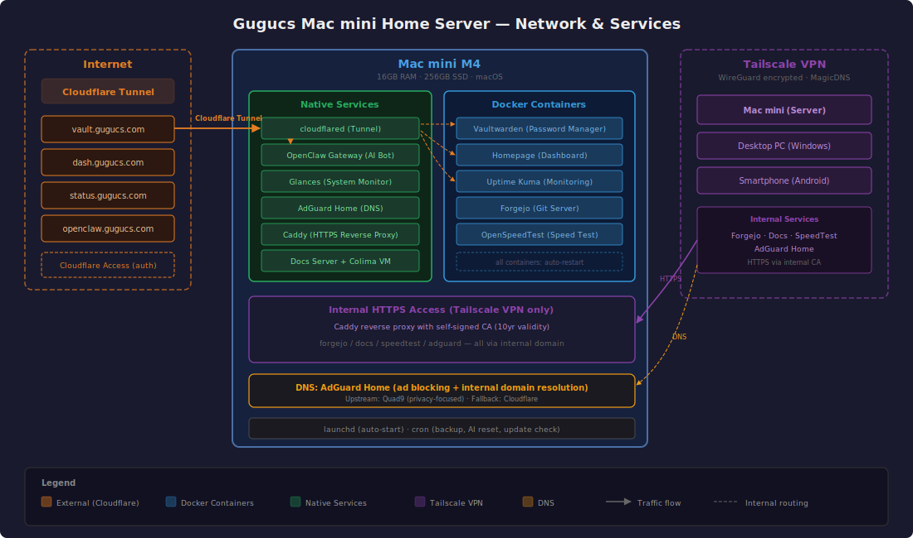

# Gugucs Mac mini Home Server

Mac mini M4 を24時間稼働のホームサーバーとして運用しています。

---

## Hardware

- **Model**: Mac mini (M4, 2024)
- **Chip**: Apple M4 (10-core CPU / 10-core GPU / 16-core Neural Engine)
- **Memory**: 16GB Unified Memory
- **Storage**: 256GB SSD
- **Network**: Wi-Fi 6E / Bluetooth 5.3 / Gigabit Ethernet

---

## Architecture Overview

サーバーは3つのネットワーク経路でアクセスされます：

**External Access (Internet)**
Cloudflare Tunnel + Cloudflare Access を使い、インターネットから安全にサービスを公開。全アクセスにメール認証を要求（一部APIはバイパス）。

**Internal Access (Tailscale VPN)**
WireGuard ベースの Tailscale でプライベートネットワークを構築。Caddy リバースプロキシと AdGuard Home DNS を組み合わせて、`.ailin` ドメインで内部サービスに HTTPS アクセス。自己署名 CA（有効期限約10年）を各デバイスにインストール済み。

**DNS**
AdGuard Home を DNS サーバーとして運用。広告ブロック + 内部ドメインの名前解決を担当。上流は Quad9（プライバシー重視）、フォールバックに Cloudflare。

---

## Services

### Password Manager — Vaultwarden
Bitwarden 互換のセルフホスト型パスワードマネージャー。ブラウザ拡張・モバイルアプリから利用可能。毎日自動バックアップ。

### Dashboard — Homepage
サーバーの状態、CPU/メモリ使用率、Docker コンテナの状況、為替・株価・暗号資産の市場データをリアルタイム表示するダッシュボード。

### Monitoring — Uptime Kuma
全サービスの死活監視。ダウン時は LINE に自動通知。ステータスページを公開。

### AI Bot — OpenClaw Gateway (AIlin)
LINE と Discord で動く AI チャットボット。Google Gemini 2.5 Flash を使用。主な機能：
- 日常会話・質問応答
- 毎朝9時の AI ニュース配信（LINE）
- 紙の書類をスキャン → PDF 変換 → OCR → Google Drive に自動分類保存
- 天気予報
- Discord サーバー管理

### Git Server — Forgejo
プライベート Git サーバー。GitHub のセルフホスト版のようなもの。サーバー構成ドキュメントや AI Bot のワークスペースをバージョン管理。Tailscale 内部からのみアクセス可能。

### Speed Test — OpenSpeedTest
HTML5 ベースのネットワーク速度測定ツール。外部サービスを使わずにサーバーとの回線速度を計測可能。

### DNS & Ad Blocker — AdGuard Home
ネットワーク全体の広告ブロック + 内部ドメイン解決。Tailscale に接続するだけで全デバイスに適用。

### Documentation Server
このドキュメントのソース Markdown を pandoc で HTML 化し、内部サーバーで配信。ファイル変更を自動検知して即座に反映。

### System Monitoring — Glances
CPU、メモリ、ディスク、ネットワーク、Docker コンテナの状態をリアルタイムに監視する API サーバー。Homepage ダッシュボードのデータソース。

---

## Tech Stack

| Category | Technology |
|----------|-----------|
| Virtualization | Colima (Lima VM) |
| Containers | Docker (5 containers) |
| Reverse Proxy | Caddy v2 (HTTPS, internal CA) |
| Tunnel | Cloudflare Tunnel + Access |
| VPN | Tailscale (WireGuard) |
| DNS | AdGuard Home + Quad9 |
| AI Model | Google Gemini 2.5 Flash (via OpenRouter) |
| AI Framework | OpenClaw |
| Git | Forgejo |
| Monitoring | Uptime Kuma + Glances |
| Automation | launchd + cron |
| Build | pandoc (Markdown → HTML) |

---

## Devices on Network

| Device | OS | Role |
|--------|-----|------|
| ailin (Mac mini) | macOS | Server (Exit Node) |
| gugucs | Windows | Desktop PC |
| z-fold7 | Android | Smartphone |

---

## Automation

- 全サービスは Mac mini 再起動後に自動起動（launchd）
- Vaultwarden: 毎日バックアップ、毎月アップデートチェック
- OpenClaw: 毎日セッション自動リセット
- ドキュメント: ソースファイル変更を自動検知 → HTML 再生成
- AI ニュース: 毎朝9時に LINE 配信

---

## Cost

| Item | Monthly Cost |
|------|-------------|
| Cloudflare (DNS + Tunnel + Access) | Free |
| Tailscale (Personal) | Free |
| LINE Official Account (200 msgs/month) | Free |
| OpenRouter API (Gemini 2.5 Flash) | ~¥500 |
| Domain (gugucs.com) | ~¥100/month equivalent |
| Electricity (Mac mini idle ~5W) | ~¥300 |
| **Total** | **~¥900/month** |

---

*Last updated: 2026-03-01*